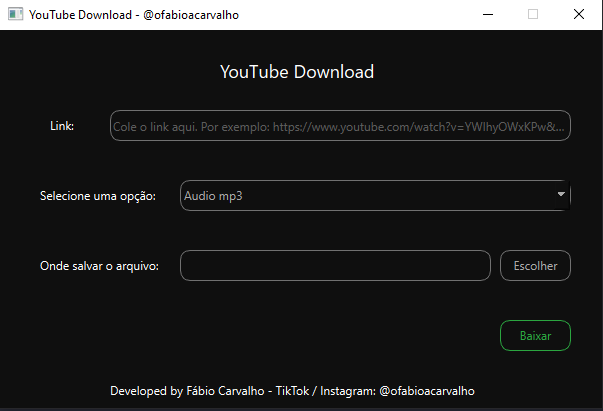

# Download Videos to YouTube

Este é um software gratuito disponibilizado para realizar downlaod de vídeos do YouTube.



## Executável (Windows)

Entre na pasta `dist` e baixe o arquivo `main.exe`, após isso só ir até o local de downlaod e executar.

## Instalação
Rode o comando abaixo para instalar as bibliotecas:

```powershell
pip install -r requirements.txt
```
## Atualizar o desgin
A arquivo de design está na pasta inter > design.ui para acessar o mesmo basta abrir o arquivo no aplicativo QT Designer que pode ser baixado pelo link abaixo:

> Pasta inter significa interface.

## Aplicativo: Qt Designer

Após a instalação basta abrir o arquivo e realizar as alterações necessárias. Lembrando de salvar o arquivo na mesma pasta novamente.

## Atualizando o arquivo design.py

Para atualizar o arquivo design.py basta acessar a pasta inter e rodar o comanado abaixo:

```powershell
pyside6-uic inter/design.ui -o inter/design.py
```

## Gerando executável
Precisamos instalar o PyInstaller:

```powershell
pip install pyinstaller
```

Para gerar um arquivo .exe exwecute o comando:

```powershell
pyinstaller --onefile -w main.py
```